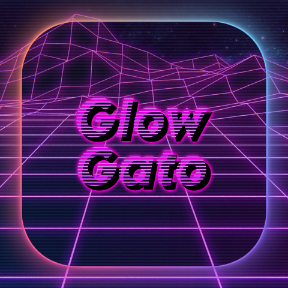

<a name="readme-top"></a>

<!-- PROJECT SHIELDS -->
[![Apple-Silicon-Shield]][Apple-Silicon-Shield-url]
[![MIT License][license-shield]][license-url]


[![LinkedIn][linkedin-shield]][linkedin-url]
[![GitHub][GitHub-shield]][GitHub-url]

<!-- PROJECT LOGO -->
<br />
<div align="center">
  <a href="">
    
  </a>

  <h3 align="center">Glow Gato</h3>

  <p align="center">
   The Ultimate Elgato Stream Deck Icon Pack
    <br />
    </div>

<!-- ABOUT THE Icon Pack -->
## About The Project


Introducing "Glow Gato" – the ultimate Elgato Stream Deck Icon Pack:

Futuristic Neon Glow: Elevate your stream deck with a captivating neon glow for a sleek and sophisticated look.

Over 300 Icons: A comprehensive collection catering to streamers, software developers, and everyday users.

Streamers' Paradise: Icons for popular platforms like Twitch, OBS, TipeeeStream, Xsplit, Kick, and YouTube.

Developer-Friendly: Tailored icons for leading IDEs including Visual Studio Code, Visual Studio, Xcode, Android Studio, Eclipse, and IntelliJ IDEs.

Multilingual Coding: Representing a variety of programming languages – C, C++, C#, Python, Java, Kotlin, Dart, Flutter, JavaScript, TypeScript, HTML, CSS, XML, Markdown, YML, PHP, React, NodeJS, SQL, and more.

Dynamic Aesthetics: Transform your workspace with dynamic and vibrant icons that enhance both your streaming and coding experience.

"Glow Gato" is more than an icon pack; it's a visual upgrade for your Elgato Stream Deck, offering a futuristic command center that reflects your unique style and passion.


<p align="right">(<a href="#readme-top">back to top</a>)</p>


<!-- GETTING STARTED -->
## Getting Started / Installation

Getting started is fairly simple...

### Option 1

* Get From Elgato Marketplace

### Option 2


* Download 
  ```sh
  com.blazewheeler.glowgato.streamDeckIconPack
  ```


 ### Place In This Location
* Mac: 
  ```sh 
	~/Library/Application Support/com.elgato.StreamDeck/Icons/
  ```

* Windows: 
  ```sh 
	%appdata%\Elgato\StreamDeck\Plugins\com.elgato.StreamDeck\Icons\
  ```

* For More Information - [Elgato SDK](https://docs.elgato.com/sdk/icon-packs/create-your-icon-pack)


<!-- LICENSE -->

# Released Under MIT License

Copyright (c) 2024 Blaze Wheeler,

Permission is hereby granted, free of charge, to any person
obtaining a copy of this software and associated documentation
files (the "Software"), to deal in the Software without
restriction, including without limitation the rights to use,
copy, modify, merge, publish, distribute, sublicense, and/or sell
copies of the Software, and to permit persons to whom the
Software is furnished to do so, subject to the following
conditions:

The above copyright notice and this permission notice shall be
included in all copies or substantial portions of the Software.

THE SOFTWARE IS PROVIDED "AS IS", WITHOUT WARRANTY OF ANY KIND,
EXPRESS OR IMPLIED, INCLUDING BUT NOT LIMITED TO THE WARRANTIES
OF MERCHANTABILITY, FITNESS FOR A PARTICULAR PURPOSE AND
NONINFRINGEMENT. IN NO EVENT SHALL THE AUTHORS OR COPYRIGHT
HOLDERS BE LIABLE FOR ANY CLAIM, DAMAGES OR OTHER LIABILITY,
WHETHER IN AN ACTION OF CONTRACT, TORT OR OTHERWISE, ARISING
FROM, OUT OF OR IN CONNECTION WITH THE SOFTWARE OR THE USE OR
OTHER DEALINGS IN THE SOFTWARE.
<p align="right">(<a href="#readme-top">back to top</a>)</p>


<!-- CONTACT -->
## Contact

Blaze Wheeler - [@blazew](https://www.instagram.com/blazew/) - wheelerb2@duq.edu

<p align="right">(<a href="#readme-top">back to top</a>)</p>

<!-- MARKDOWN LINKS & IMAGES -->

[Apple-Silicon-Shield]: https://img.shields.io/badge/Apple-Silicon_M2-999999?style=for-the-badge&logo=apple&logoColor=white
[Apple-Silicon-Shield-url]: https://support.apple.com/en-us/HT211814

[license-shield]: https://img.shields.io/github/license/othneildrew/Best-README-Template.svg?style=for-the-badge
[license-url]: https://www.mit.edu/~amini/LICENSE.md
[linkedin-shield]: https://img.shields.io/badge/-LinkedIn-black.svg?style=for-the-badge&logo=linkedin&colorB=555

[linkedin-url]:https://www.linkedin.com/in/blaze-wheeler-8306a2223/
[GitHub-shield]: 	https://img.shields.io/badge/GitHub-100000?style=for-the-badge&logo=github&logoColor=white
[GitHub-url]: https://github.com/blazeWheeler
[product-screenshot]: images/screenshot.png

[HTML-url]: https://www.w3schools.com/howto/howto_make_a_website.asp
[HTML-badge]: https://img.shields.io/badge/HTML5-E34F26.svg?style=for-the-badge&logo=HTML5&logoColor=white
[CSS-url]: https://www.w3schools.com/css/
[CSS-badge]: https://img.shields.io/badge/CSS3-1572B6.svg?style=for-the-badge&logo=CSS3&logoColor=white

[Javascript-url]: https://www.w3schools.com/js/
[JavaScript-badge]: https://img.shields.io/badge/JavaScript-F7DF1E.svg?style=for-the-badge&logo=JavaScript&logoColor=black

[PHP-url]: https://www.php.net/docs.php
[PHP-badge]: https://img.shields.io/badge/PHP-777BB4.svg?style=for-the-badge&logo=PHP&logoColor=white

[Telegram-url]: https://core.telegram.org/bots/api
[Telegram-badge]: https://img.shields.io/badge/Telegram%20API-26A5E4.svg?style=for-the-badge&logo=Telegram&logoColor=white

[Duq-url]: https://duq.edu
[Duq-badge]:(https://custom-icon-badges.demolab.com/badge/-Duquesne%20University-ba0c2f?style=for-the-badge&logo=duquesne_dukes_logo1)